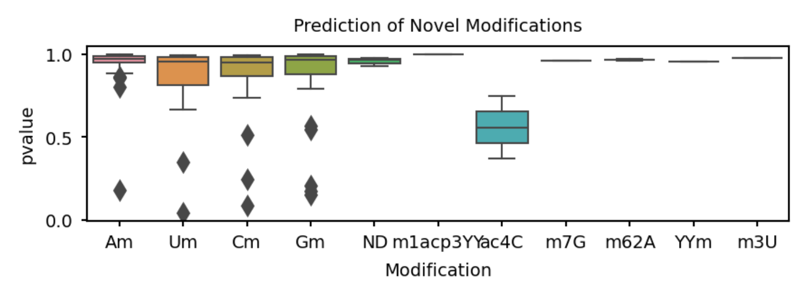

# 24.7.22版本更新公告
- 截止2024年7月22日19:30

## 1. 下载数据

### 1.1 IVT数据 (For Fig. 2c)：**268GB**/500.9GB    53%
### 1.2 Nm数据 (For Fig. 4)：重新下载。

## 2. 文献阅读

### 2.1 Nm数据下载的必要性
原来文献提供了下列数据：
|细胞系|处理|文件大小|
|:----:|:----:|:----:|
|C4-2|siCTRL|130.1GB|
|C4-2|siCTRL|142.5GB|
|C4-2|siFBL|146.2GB|
|C4-2|siFBL|143.5GB|

于是重新下载。

### 2.2 没有了。

## 3. 软件运行

### 3.1 成功安装了 Epinano-Diff 的环境，通过Remote和BioConductor。

### 3.2 执行了 Epinano-Diff 对m5C的预测。

### 3.2 执行了 Tombo Resquiggle 。之前之所以失败，似乎是因为一个非常离谱的简单错误。不予记录。要脸。总之已经在重新运行了。

### 3.3 执行了 TandemMod 对m6A的预测。除了GPUfat随时有可能寄寄之外没有什么其他问题。
- 现在去看一眼。
- 
- 很危险。

## 4. 画图

## 4.1 继续画了TrackPlot。加进去了 delta match ratio。
- 

## 4.2 重新画了Fig. 1里的Feature Matrix (使用python)
- 

## 4.3 查看了rRNA上的修饰识别情况。
|修饰类型|数量|修饰类型|数量
|:----:|:----:|:----:|:----:|
|Am|33|m62A|2|
|Gm|31|m1acp3ψ|1|
|Cm|24|m7G|1|
|Um|20|ψm|1|
|ND|3|m3U|1|
|ac4C|2|||

- 

# 5. 明日计划

## 5.1 监督数据继续下载。
## 5.2 监督软件继续运行。
## 5.2 把电流均值和二代答案加到track里
## 5.3 看看伊成器的文献里有没有能用的m5C位点信息。
## 5.4 看看Nm文章里的一些分析（比如Nm所在碱基比例）能不能用在我们找到的Nm位点上。
